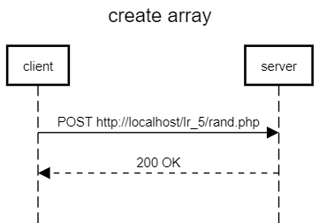
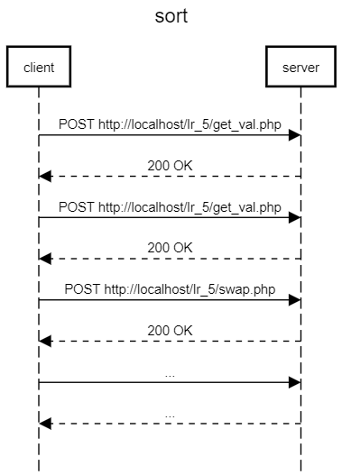

# Алгоритм внешней сортировки
# Разработка сервисов
## Текст задания
### Цель работы
Разработать и реализовать алгоритм внешней сортировки. Данные хранятся на сервере в массиве, сервер предоставляет доступ у отдельным элементам. Клиент поочередно запрагивая отдельные ячейки сортирует массив.
## Ход работы
- Пользовательский интерфейс
- Пользовательские сценарии работы
- API сервера и хореографию
- Структура базы данных
- Алгоритмы


2) Пользовательские сценарии работы

Пользователь попадает на страницу *index.php*. При нажатии на кнопку *Генерация массива* на сервере генерируется случайный массив размером, который ввел пользователь, и записывается в бд. При нажатии на кнопку *Sort* происходит сортировка массива на клиенте, после завершения сортировки появляется сообщение *sucsess*.

3. API сервера и хореография





4. Структура БД

| Название | Тип | Длина | NULL | Описание |
| :------: | :------: | :------: | :------: | :------: |
| **id** | INT | - | - | id элемента |
| **keyarr** | INT | - | - | ключ элемента |
| **value** | INT | - | - | значение элемента |

## 5. Алгоритм
### [Алгоритм](https://imgur.com/a/OJG9bmD)
6. HTTP запросы/ответы

*Запрос*

POST /lr_5/getval.php HTTP/1.1 <br>
Host: localhost <br>
Accept: text/plain, */*; q=0.01 <br>
Content-Type: application/x-www-form-urlencoded; charset=UTF-8 <br>
sec-ch-ua: "Not_A Brand";v="99", "Google Chrome";v="109", "Chromium";v="109" <br>
sec-ch-ua-mobile: ?0 <br>
sec-ch-ua-platform: "Windows" <br>
User-Agent: Mozilla/5.0 (Windows NT 10.0; Win64; x64) AppleWebKit/537.36 (KHTML, like Gecko) Chrome/109.0.0.0 Safari/537.36 <br>
X-KL-Ajax-Request: Ajax_Request <br>
X-Requested-With: XMLHttpRequest <br>

*Ответ*

HTTP/1.1 200 OK <br>
Connection: Keep-Alive <br>
Content-Length: 3 <br>
Content-Type: text/html; charset=UTF-8 <br>
Date: Mon, 16 Jan 2023 13:11:40 GMT <br>
Keep-Alive: timeout=120, max=998 <br>
Server: Apache <br>
X-Content-Type-Options: nosniff <br>

7. Значимые фрагменты кода

*Функция сортировок*
```js
  function bblSort(arr_key) {
        for (arr_key = 0; arr_key < arr_size; arr_key++) {
            if (getval(arr_key) > getval(arr_key + 1)) {
                swap(arr_key, arr_key + 1);
            }
        }
    }
    function Sort(){
        $("#sort").prop("disabled",true);
        $("#create").prop("disabled", true);
        for (let i = 0;i < arr_size;i++){
            bblSort(i);
        }
        alert("success");
        $("#create").prop("disabled", false);
    }
```
